> **Note:** This engagement was conducted in a sandboxed lab enviroment. The target and client are fictional and the scenario was created for the purpose of demonstrating technical and reporting skills.

## 1.0 EXECUTIVE SUMMARY

> A penetration test was conducted on the external web server at IP address 10.129.1.211 on September 9, 2025. The assessment revealed several critical-risk vulnerabilities that collectively allowed a remote, unauthenticated attacker to gain full administrative control over the server.

The key findings include the public exposure of sensitive user credentials, the use of a cryptographically weak password hashing algorithm (SHA1), and a vulnerable version of the GetSimple Content Management System (CMS) that permitted remote code execution. Post-exploitation, a privilege escalation vulnerability was identified and exploited to gain root-level access to the underlying Linux operating system.

The combination of these vulnerabilities represents a significant risk to the organization, potentially leading to data theft, service disruption, and reputational damage. It is strongly recommended that the client immediately update the web application, remediate the sudo privilege misconfiguration, and implement a stronger password protection policy

## 2.0 TECHNICAL FINDINGS & ANALYSIS
This section provides a detailed account of the vulnerabilities identified during the assessment, the methodology used to exploit them, and the evidence gathered at each stage.

## 2.1 PHASE 1: INFORMATION GATHERING
The initial phase of the assessment focused on identifying active services and potential web application attack vectors on the target system at 10.129.1.211.

An initial port scan using Nmap revealed two open services: OpenSSH on port 22 and an Apache web server on port 80. Further enumeration of the HTTP service using Nmap's http-enum script identified several potentially sensitive directories, including `/admin`, `/backups`, and `/data/`

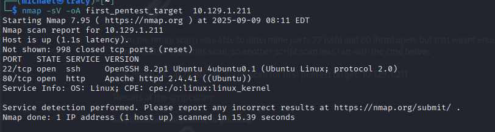

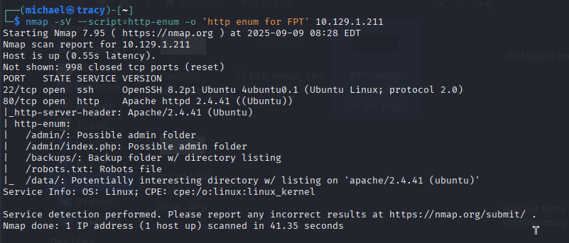

To supplement these findings, a directory brute-force attack was conducted using Gobuster with the `common.txt` wordlist. This scan confirmed the presence of the previously discovered directories and provided a more comprehensive map of the web application's structure.

The results of this initial reconnaissance phase are summarized below:

###### OPEN PORTS:
`22/tcp`- OpenSSH 8.2p1
`80/tcp`- Apache httpd 2.4.41

###### KEY DIECTORIES DISCOVERED:
`/admin/` (Admin Panel)
`/backups/`
`/data/`
`/plugins/`
`/theme/`

The discovery of the `/data/` and `/admin/` directories, in particular, presented a clear path for further investigation into potential information disclosure vulnerabilities.

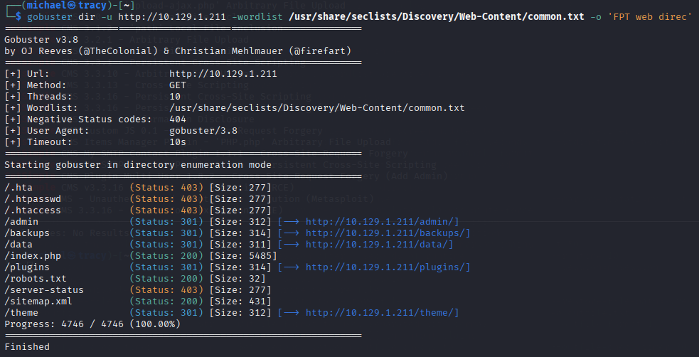

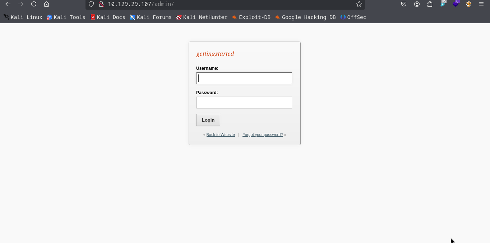

## PHASE 2: INITIAL COMPROMISE VIA CREDENTIAL EXPOSURE
Following the discovery of the `/data/` directory, further investigation was conducted to identify potential information disclosure vulnerabilities.

###### INFORMATION DISCLOSURE:
Manual enumeration using cURL revealed that the subdirectory `/data/users/` was  publicly accessible. This directory contained a file named `admin.xml`. Analysis of this file exposed sensitive application data, including the administrator's username (`admin`) and a password hash (`d033e22ae348aeb5660fc2140aec35850c4da997`).

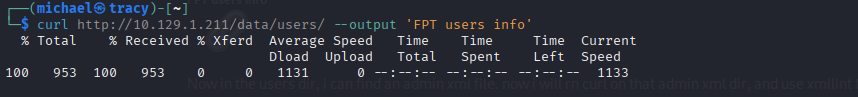

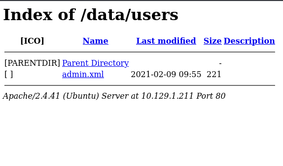

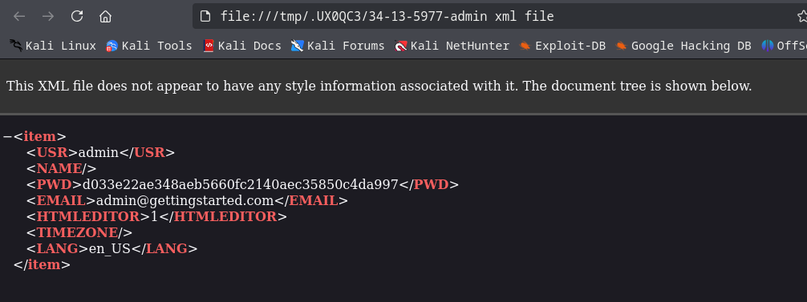

###### WEAK HASHING & PASSWORD CRACKING:
The extracted hash was identified as SHA1, which is considered a cryptographically weak algorithm susceptible to collision attacks and not suitable for password storage. An offline password cracking attack was performed using Hashcat with the `rockyou.txt` wordlist. The attack successfully recovered the plaintext password for the `admin` user: admin.

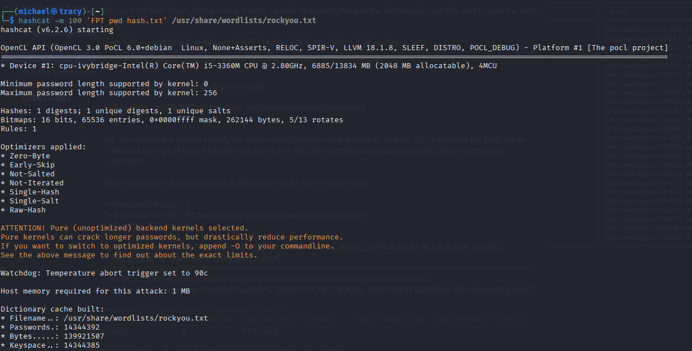

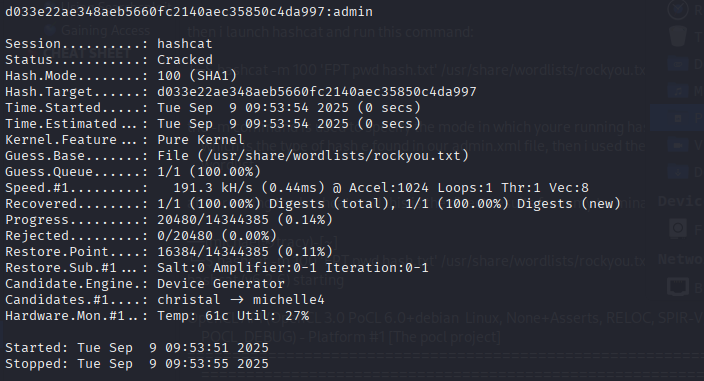

###### AUTHENTHICATED ACCESS:
The recovered credentials (`admin:admin`) were used to successfully authenticate to the GetSimple CMS administrative panel at `http://10.129.1.211/admin/`. This action confirmed the initial compromise and granted the tester authenticated, administrative access to the web application.

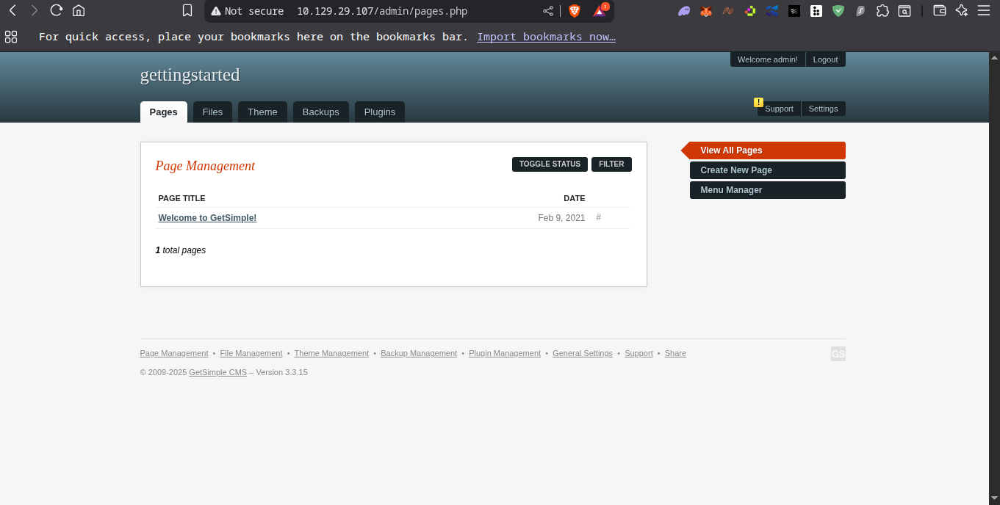

## PHASE 3: REMOTE CODE EXECUTION & PRIVILEGE ESCALATION
Following the successful authentication to the GetSimple CMS, the next objective was to leverage this access to gain a persistent foothold on the underlying server.

###### REMOTE CODE EXECUTION (RCE):
Research using Searchsploit confirmed that the identified GetSimple CMS version is vulnerable to multiple public exploits. An unauthenticated Remote Code Execution (RCE) vulnerability was selected for exploitation. The Metasploit Framework was used to configure and launch the corresponding exploit module (`exploit/multi/http/getsimplecms_unauth_code_exec`). After setting the required parameters (RHOSTS, LHOST, LPORT), the exploit was successfully executed against the target. This action established a reverse TCP Meterpreter session, providing a command-line interface on the server as the `www-data user`.

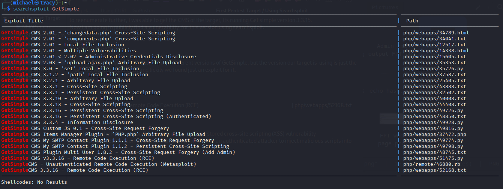

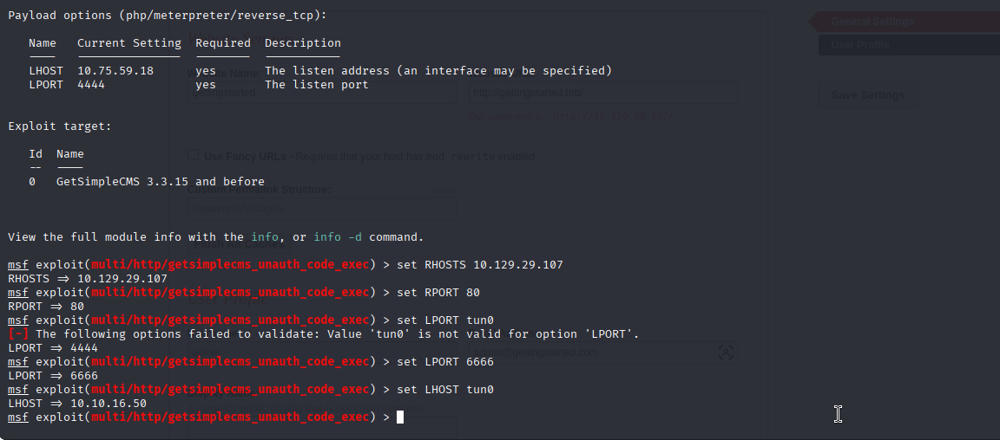

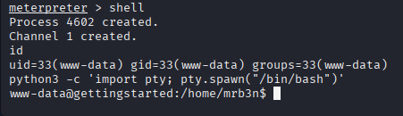

###### PRIVILEGE ESCALATION:
The initial shell provided low-privilege access as the `www-data user`. To identify paths for privilege escalation, the `LinEnum.sh` script was uploaded to the target's `/tmp` directory from a local Python HTTP server. Execution of the script revealed a critical misconfiguration in the `/etc/sudoers file`. The `www-data` user was permitted to run the `/usr/bin/php` binary as any user, including root, without requiring a password (`NOPASSWD`). This misconfiguration was exploited by executing the following command: `sudo /usr/bin/php -r 'system("/bin/bash`");'. This command successfully spawned a new shell with root privileges, achieving the final objective.

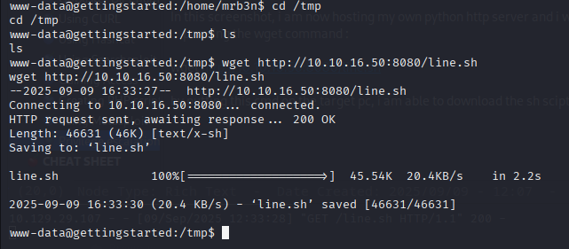

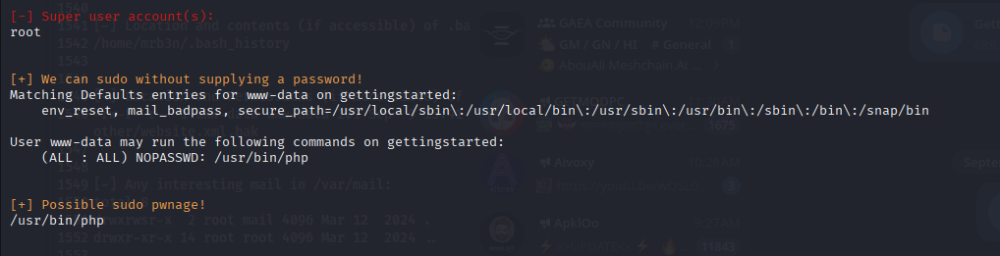

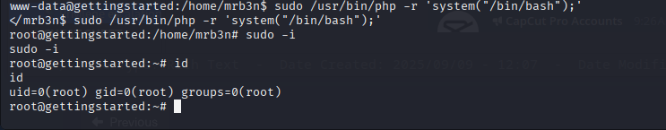

###### PROOF OF COMPROMISE:
As evidence of successful exploitation and to validate the achievement of the engagement's objectives, the user and root flags were captured from the target system.

###### USER FLAG:
The contents of `/home/mrb3n/user.txt` were successfully read after establishing an initial foothold

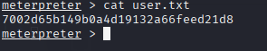

###### ROOT FLAG:
Following privilege escalation, the contents of `/root/root.txt` were successfully read, confirming full administrative control over the server.

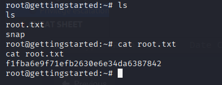

## 3.0 REMEDIATION AND RECOMMENDATIONS

The following recommendations are provided to address the vulnerabilities identified during the assessment. It is advised that these actions be implemented in a timely manner to improve the overall security posture of the application and server.

###### 3.1 (CRITICAL) - UPDATE VULNERABLE GetSimple CMS:
The root cause of the initial compromise was an outdated and vulnerable version of the GetSimple CMS. Recommendation: Immediately update the GetSimple CMS to the latest stable and patched version available from the vendor. A regular patch management schedule should be implemented to ensure all web application components are kept up-to-date.

###### 3.2 (CRITICAL) - REMEDIATE SUDO PRIVILEGE ESCALATION:
The `www-data` user possessed excessive privileges, allowing a low-privilege web user to become the root user. Recommendation: The principle of least privilege must be enforced. The entry allowing the `www-g` user to run commands via `sudo` should be removed from the `/etc/sudoers` file immediately.

###### 3.3 (HIGH) - REMEDIATE INFORMATION DISCLOSURE:
The `admin.xml` file, containing a username and password hash, was publicly accessible. Recommendation: Restrict access to all sensitive application directories, including `/data`, by configuring the web server to deny direct requests.

###### 3.4 (HIGH) - IMPLEMENT STRONG PASSWORD POLICIES:
The administrator account used a weak, easily guessable password (`admin`) and a deprecated hashing algorithm (SHA1). Recommendation: Enforce a strong password policy for all users. Furthermore, the application should be updated to use a modern, strong password hashing algorithm such as Argon2 or bcrypt.

## CONCLUSION
The penetration test of the GetSimple CMS web server at 10.129.1.211 was successful. The engagement simulated a real-world attack scenario, demonstrating that a series of chained vulnerabilities could be exploited by a remote attacker to gain complete administrative control of the target server.

The findings detailed in this report highlight critical risks that require immediate attention. It is strongly recommended that the remediation steps outlined in Section 3.0 be implemented to mitigate these risks and secure the environment against future attacks.

